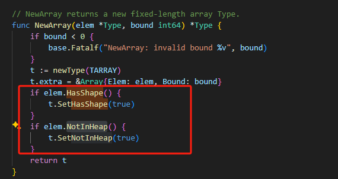

### 调试源代码

将go语言的源代码编译成汇编语言，然后通过汇编语言分析程序具体的执行过程

```go
go build -gcflags -S main.go
```
获取汇编指令的优化过程，获取ssa文件

```go
GOSSAFUNC=main go build main.go
```

### 编译原理
词法分析->语义分析->类型检查->中间代码生成->代码优化->机器码生成。

### 数组

数组的申请方式

