# Go语言循环永动机工作原理流程图

## 1. 基础无限循环永动机

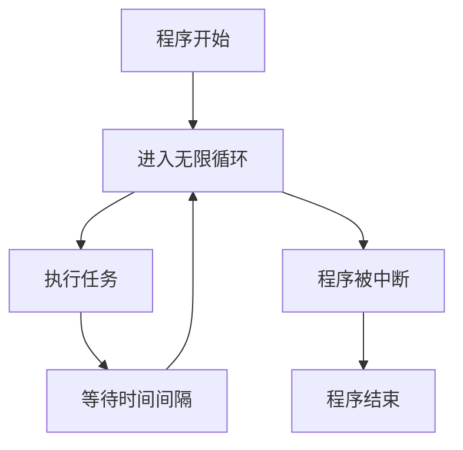

## 2. Goroutine协作永动机

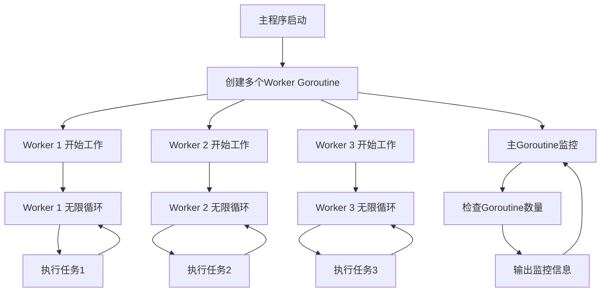

## 3. Channel通信永动机

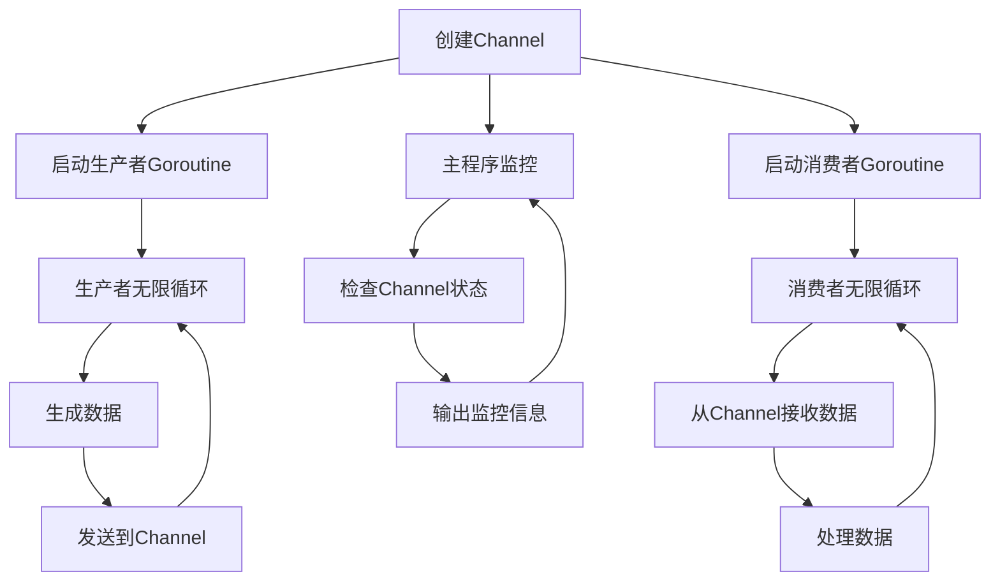

## 4. Select多路复用永动机

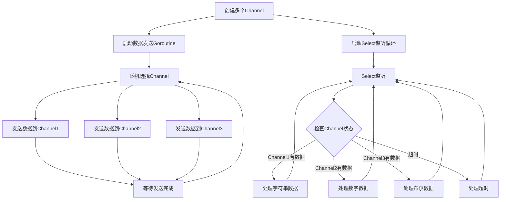

## 5. 定时器永动机

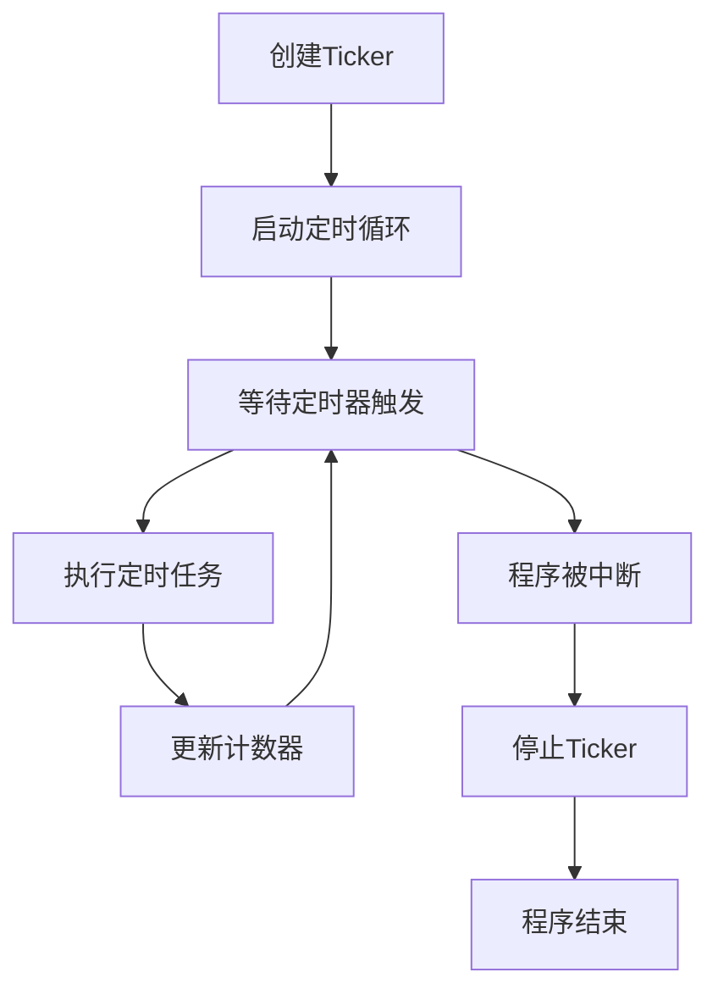

## 6. 系统监控永动机

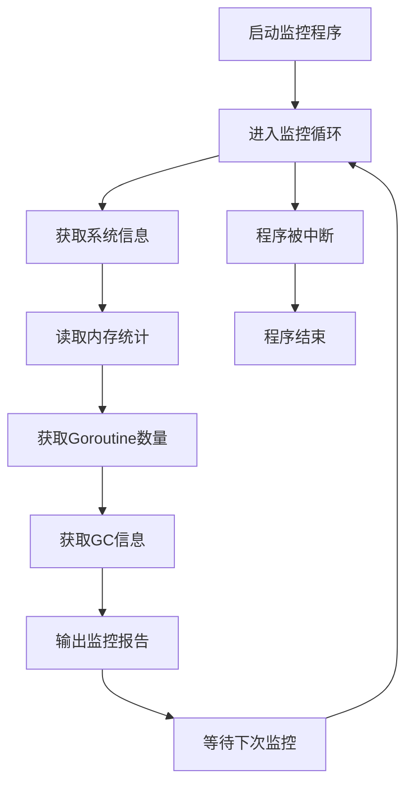

## 7. 优雅退出永动机

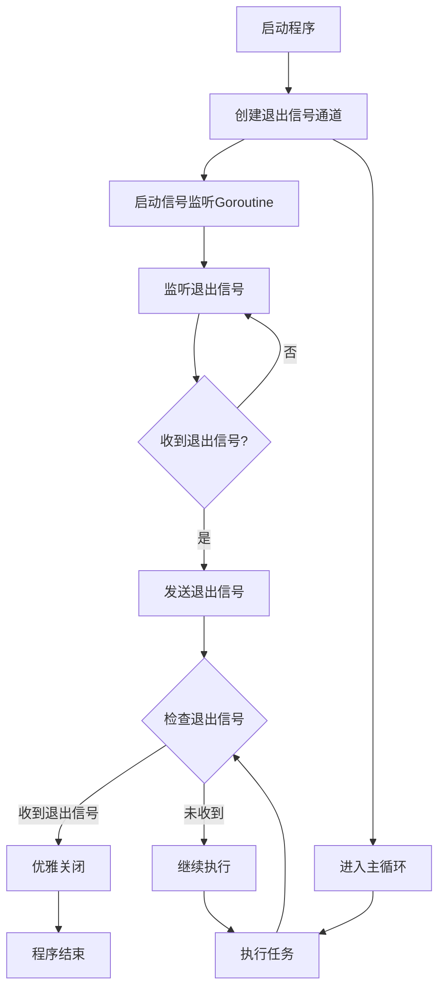

## 8. 递归永动机

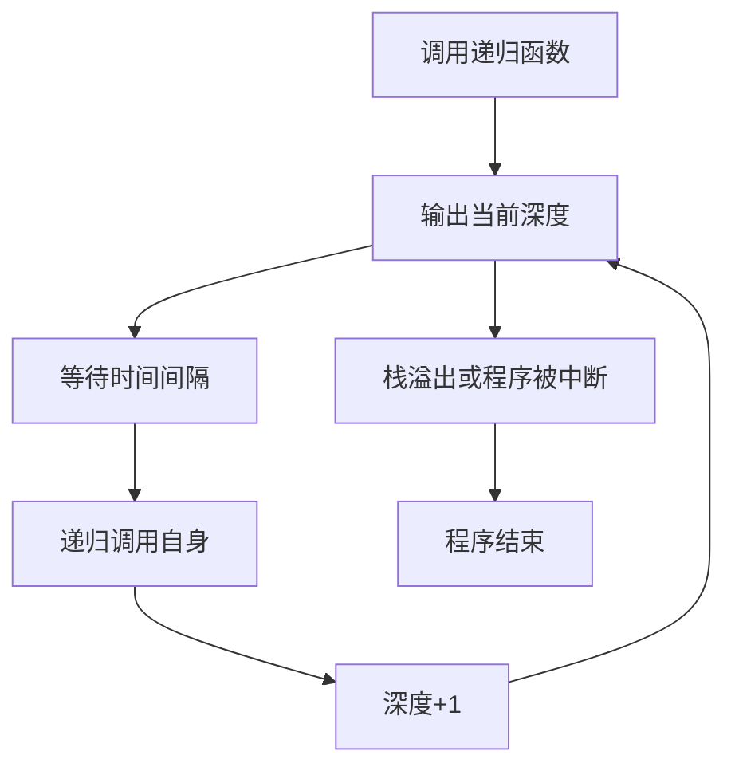

## 9. 内存分配永动机

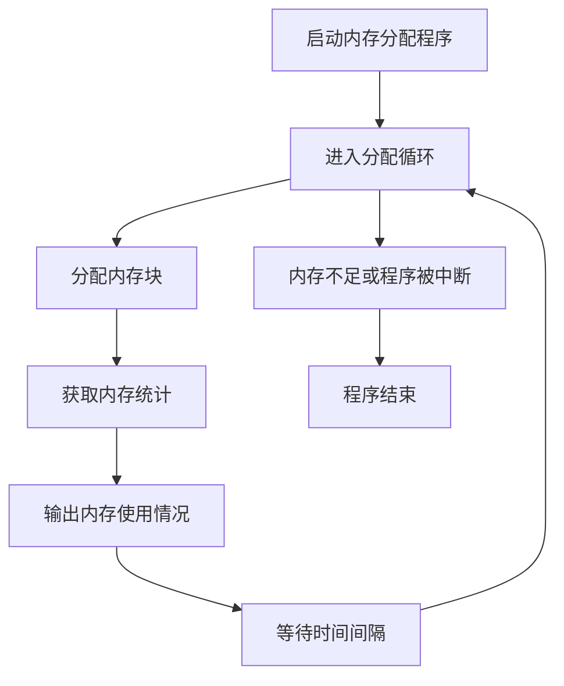

## 10. 整体永动机系统架构

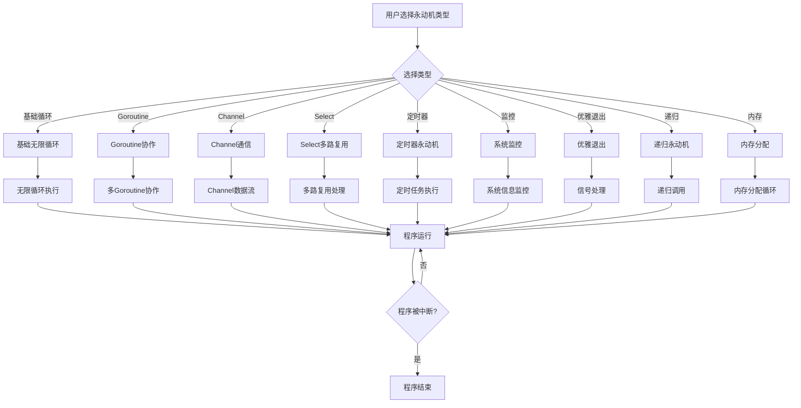

## 11. 资源管理流程图

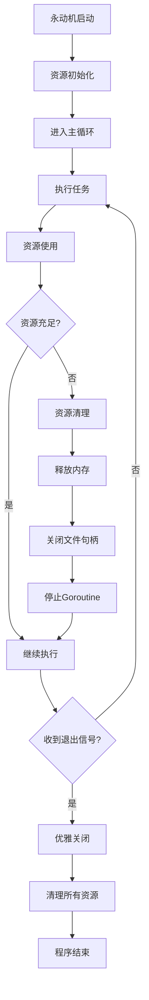

## 12. 错误处理流程图

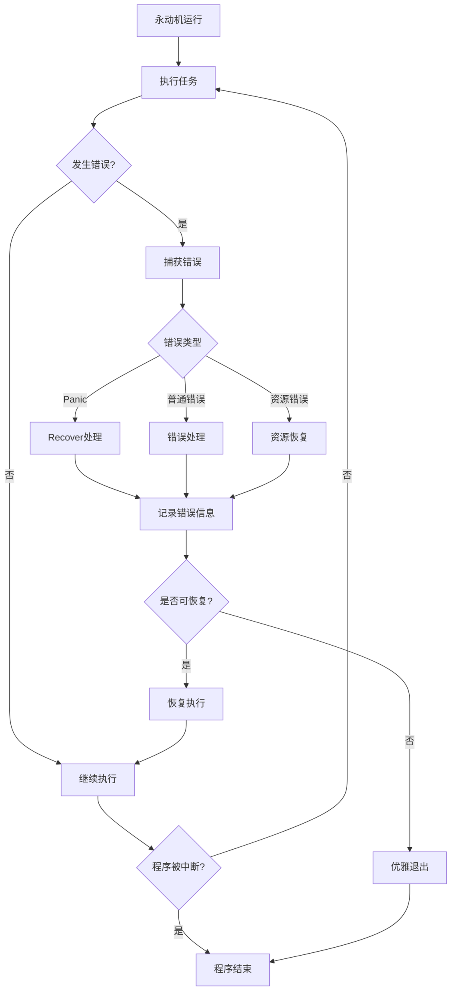

## 总结

这些流程图展示了Go语言中各种类型的循环永动机的工作原理：

1. **基础循环**: 最简单的无限循环结构
2. **并发协作**: 多个Goroutine协同工作
3. **通信机制**: 通过Channel进行数据交换
4. **多路复用**: 使用Select监听多个事件
5. **定时执行**: 基于时间间隔的循环
6. **系统监控**: 持续监控系统状态
7. **优雅退出**: 支持信号处理的循环
8. **递归调用**: 通过递归实现循环
9. **资源管理**: 合理管理内存和系统资源
10. **错误处理**: 健壮的错误恢复机制

每种永动机都有其特定的应用场景和注意事项，需要根据实际需求选择合适的实现方式。 